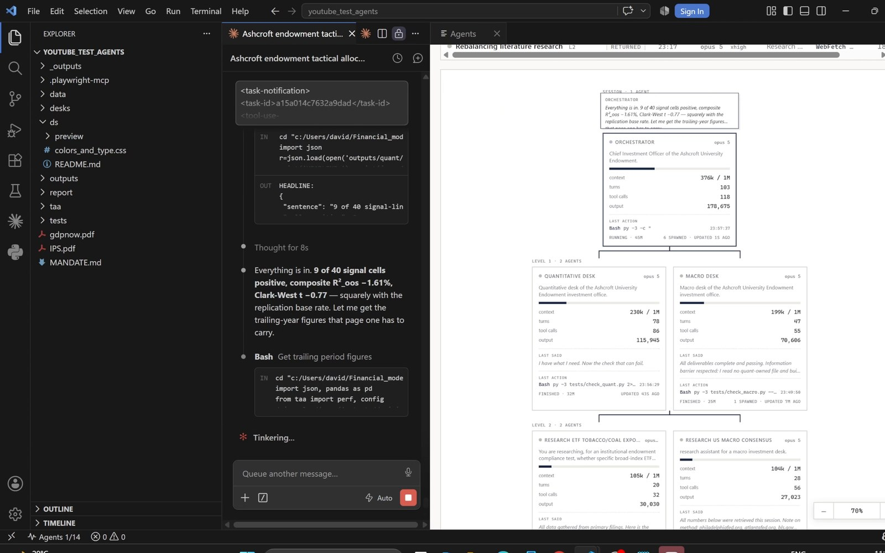
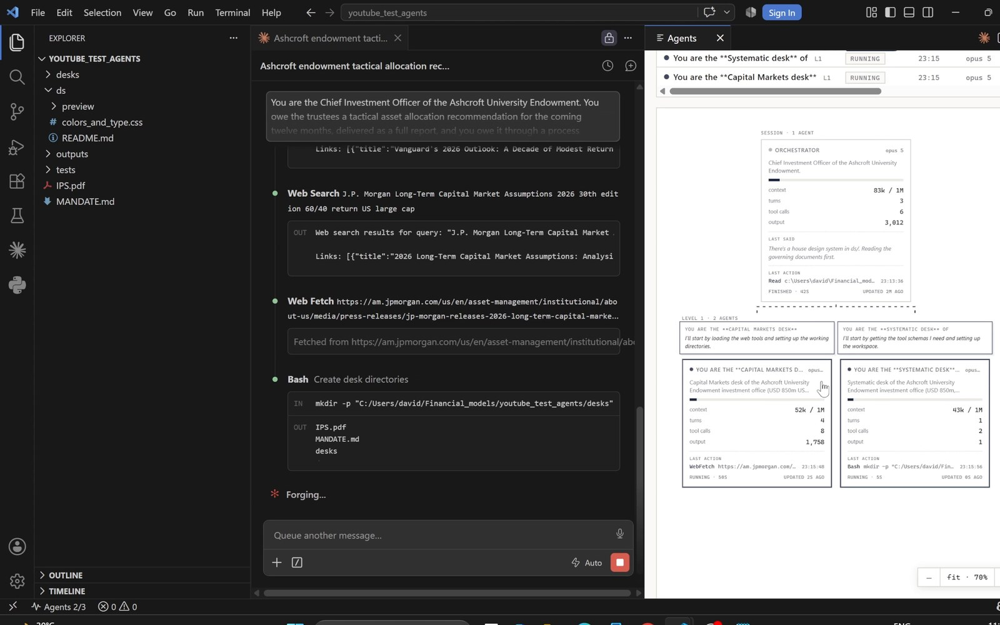
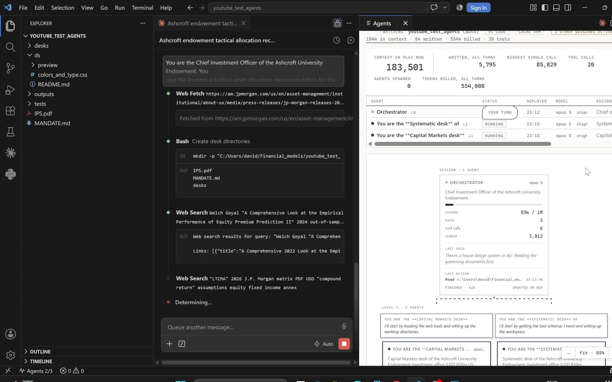
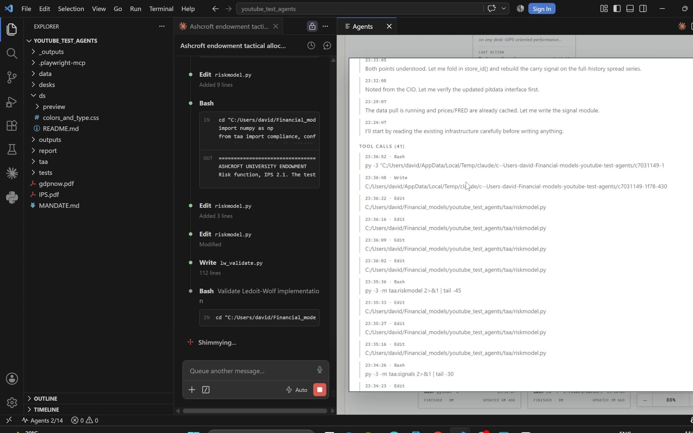

<div align="center">


# Agent Max

**See what your Claude Code agents are actually doing, while they do it.**

[](https://marketplace.visualstudio.com/items?itemName=Davidarias01.agent-max)
[](https://marketplace.visualstudio.com/items?itemName=Davidarias01.agent-max)
[](https://marketplace.visualstudio.com/items?itemName=Davidarias01.agent-max)
[](LICENSE)

</div>

When a session delegates, the work disappears. You see *"Agent launched
successfully"* and then nothing until it returns. Agent Max puts the whole tree
on screen while it runs: every agent, what it is working on, how much context it
is holding, and what it has spent.


## Install

**From VS Code:** open the Extensions view, search `Agent Max`, click Install.

**From the command line:**

```
code --install-extension Davidarias01.agent-max
```

## Opening it

Three ways, depending on where you want it. The watcher starts on first open,
whichever you pick.

**Start in the bottom panel.** After installing, there is an **Agents** tab
next to Terminal, Problems and Output. Nothing to run, it is just there.

**Then send it to the right.** In that panel's title bar there is a split icon.
Click it and the exhibit opens as a normal editor tab in the column beside your
code, where it can be split, moved or maximised like any other tab.

**Or from the status bar.** There is an **Agents** item at the bottom left from
the moment you install. Click it to open the exhibit. During a run it turns
into a live count, `2/8 agents`, so you can see work happening without opening
anything. `agentMax.statusBar` removes it.

The same thing is on the command palette as **Agent Max: Open Beside Editor**,
and the panel itself can be moved with a right-click → *Move Panel Right* if you
would rather keep it as a panel.

**In a browser:** **Agent Max: Open in Browser**, useful on a second monitor.

No default keyboard shortcut ships with the extension, deliberately, because a
single combo would collide with whatever you already have bound. To add your
own: <kbd>Ctrl</kbd>+<kbd>K</kbd> <kbd>Ctrl</kbd>+<kbd>S</kbd>, search
`Agent Max`, click the `+` next to the command you want.

> **Requires Python 3.9 or later** on your PATH. The watcher is a single
> standard-library script with no pip dependencies, bundled with the extension.
> It is found automatically (`py -3` on Windows, then `python3`, then `python`);
> if yours lives somewhere unusual, set `agentMax.pythonPath`.

## Features

### The tree, to any depth

Agents that spawn their own agents nest under them. A run three levels deep
looks three levels deep, and each card carries context against the window,
turns, tool calls and output tokens.



### What each agent is doing, right now

Agents appear the moment they are created, with the brief they were given.



**Last said** is the most recent line from that agent. **Last action** is the
last tool call it made, with a timestamp. Between them you can tell a stuck
agent from a slow one without opening anything.

### Session totals, kept apart



| | |
|---|---|
| **Context in play** | size of the current prompt. A snapshot, not a running total |
| **Written, all turns** | output tokens the session actually produced |
| **Biggest single call** | the largest one, useful for spotting a context blow-up |
| **Billed, all turns** | the cumulative cost, high because every turn re-sends its context |

Filter the agent list by session, depth, model, or down to agents that did real
work, which is the fastest way to hide the ones that spawned and returned
immediately.

### Dialogue, log and trace



Open any agent and read it back. Everything it said with timestamps, every tool
call in order, and the raw trace underneath. You can follow a number in the
output back to the call that produced it.

## Commands

| Command | Description |
|---|---|
| `Agent Max: Open Beside Editor` | Open as an editor tab to the right |
| `Agent Max: Show in Bottom Panel` | Focus the panel view |
| `Agent Max: Restart Watcher` | Stop and restart the local process |
| `Agent Max: Open in Browser` | Open the same page outside VS Code |
| `Agent Max: Show Logs` | Output channel, when something is wrong |

## Settings

| Setting | Default | Description |
|---|---|---|
| `agentMax.pythonPath` | `""` | Python 3.9+ interpreter. Empty means auto-detect |
| `agentMax.port` | `8780` | Localhost port the watcher listens on |
| `agentMax.limit` | `16` | Maximum transcripts watched at once |
| `agentMax.recentMinutes` | `90` | Hide agents idle longer than this. `0` shows all |
| `agentMax.statusBar` | `true` | Show the status bar item, with a live count during a run |
| `agentMax.autoStart` | `true` | Start the watcher when the view opens |
| `agentMax.watcherDir` | `""` | Advanced. Point at your own copy of the watcher |

`agentMax.limit` is worth knowing about. Agents past the cap are hidden without
warning, so if a run fans out wider than you expected, raise it.

## Privacy

**Everything is local. The extension makes no network requests.**

The watcher reads Claude Code's own transcript files under `~/.claude/projects/`,
which is where your sessions already live, and serves a page on `127.0.0.1`.
Nothing is uploaded, no API keys are read, no telemetry is collected, and no
data leaves the machine. The port is bound to the loopback address only, so it
is not reachable from your network.

The watcher is a single readable Python file:
[`watcher/watch_agents.py`](watcher/watch_agents.py).

## Known behaviour

- If the port is already serving, the extension **reuses it** rather than
  starting a second watcher. Two processes on one port means the second binds
  nothing and exits quietly, which looks identical to the extension being broken.
- Closing the last VS Code window stops the watcher it started.

## Contributing

Issues and pull requests welcome at
[github.com/davidalmeida90/agent-max](https://github.com/davidalmeida90/agent-max/issues).

To run from source: clone the repo, open it in VS Code, press <kbd>F5</kbd> to
launch an Extension Development Host. To build a `.vsix`, run `npm run package`.

## Not affiliated with Anthropic

An independent tool that reads local Claude Code transcripts. Not built,
endorsed or supported by Anthropic.

## License

[MIT](LICENSE) © David Arias
