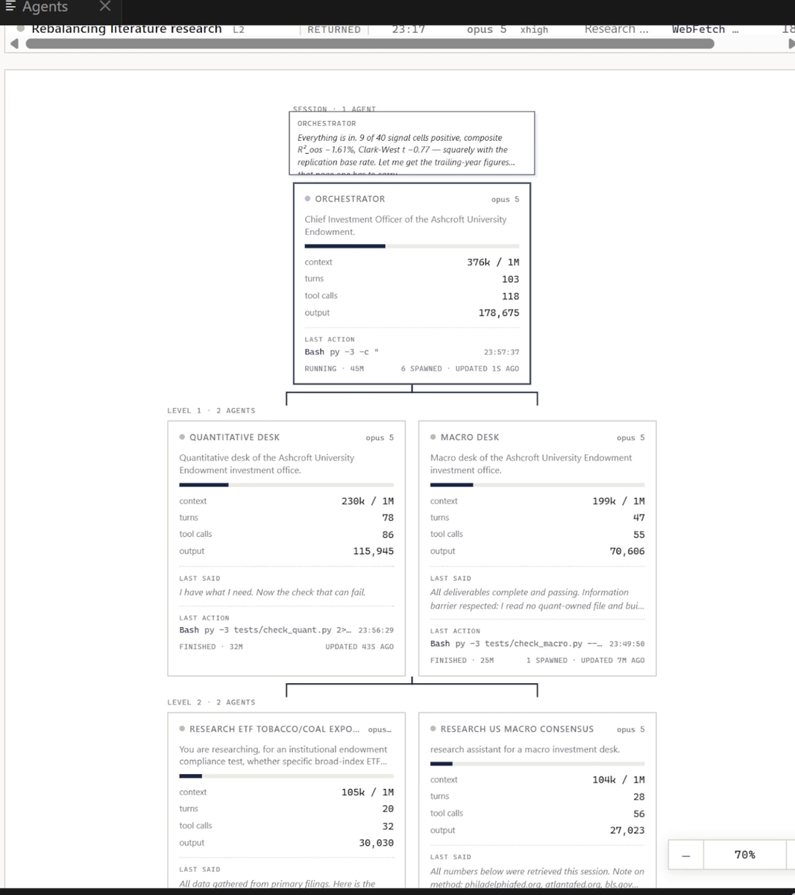

# Agent Exhibit

A live view of what your Claude Code agents are actually doing.

When a session delegates, the work disappears. You see "Agent launched
successfully" and then nothing until it returns. This puts the whole tree on
screen while it runs: every agent, what it is working on, how much context it
is holding, and what it has spent.

## What it shows

**The tree, to any depth.** Agents that spawn their own agents nest under them.
A run that goes three levels deep looks three levels deep.

**Per agent:** context in play against the window, turns, tool calls, output
tokens, the model it is running on, and whether it is working, finished or
orphaned.

**What it last said and last did.** The most recent line from the agent, and
the last tool call it made, with a timestamp. Enough to tell a stuck agent from
a slow one without opening anything.

**Dialogue, log and trace.** The full back and forth, every tool call in order,
and the raw trace when you need it.

**Filters** by session, depth, model, and whether an agent did real work, which
is the quickest way to hide the ones that spawned and returned immediately.

## Requirements

**Python 3.9 or later** on your PATH. The watcher is a single standard-library
script with no pip dependencies, bundled with the extension.

It is found automatically: `py -3` on Windows, then `python3`, then `python`.
If yours lives somewhere unusual, set `agentExhibit.pythonPath`.

## Use

Open the **Agents** panel at the bottom, or run **Agent Exhibit: Open Beside
Editor** from the command palette. The watcher starts on first open.

| Command | |
|---|---|
| `Agent Exhibit: Open Beside Editor` | opens it as an editor tab |
| `Agent Exhibit: Show in Bottom Panel` | focuses the panel view |
| `Agent Exhibit: Restart Watcher` | stops and restarts the local process |
| `Agent Exhibit: Open in Browser` | opens the same page outside VS Code |
| `Agent Exhibit: Show Logs` | the output channel, when something is wrong |

## Settings

| Setting | Default | |
|---|---|---|
| `agentExhibit.pythonPath` | auto | Interpreter used to run the watcher |
| `agentExhibit.port` | `8780` | Localhost port |
| `agentExhibit.limit` | `16` | Transcripts watched at once |
| `agentExhibit.recentMinutes` | `90` | Hide agents idle longer than this. `0` shows all |
| `agentExhibit.autoStart` | `true` | Start the watcher when the view opens |
| `agentExhibit.watcherDir` | bundled | Point at your own copy of the watcher |

`limit` is worth knowing about. Agents past the cap are hidden without warning,
so if a run fans out wider than you expected, raise it.

## Privacy

Everything is local and it makes no network requests.

The watcher reads Claude Code's own transcript files under
`~/.claude/projects/`, which is where your sessions already live, and serves a
page on `127.0.0.1`. Nothing is uploaded, no API keys are read, no telemetry is
collected, and no data leaves the machine.

The port is bound to the loopback address only, so it is not reachable from
your network.

## Notes

If the port is already serving, the extension reuses it rather than starting a
second watcher. Two processes on one port means the second binds nothing and
exits quietly, which looks identical to the extension being broken.

Closing the last VS Code window stops the watcher it started.

## Not affiliated with Anthropic

An independent tool that reads local Claude Code transcripts. Not built,
endorsed or supported by Anthropic.

## License

MIT
